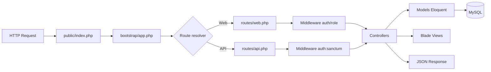
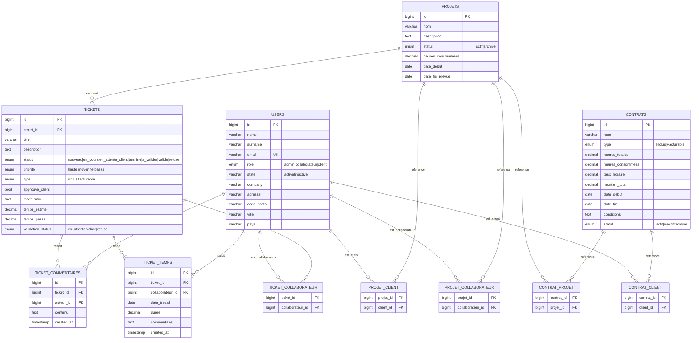

# Vector Laravel OP - Documentation Technique de Référence

Cette documentation est la source de vérité technique du projet. Elle est conçue pour:

- les développeurs backend/frontend,
- les profils DevOps/QA,
- les intégrateurs API,
- les IA de génération/refactorisation de code.

---

## 1) Vue d'ensemble du produit

Vector Laravel OP est une application de gestion opérationnelle de type ERP/CRM orientée:

- gestion des utilisateurs (admin, collaborateur, client),
- gestion des projets,
- gestion des tickets,
- gestion des contrats,
- saisie et consolidation du temps,
- interface web Blade + API REST sécurisée par Sanctum.

Le projet suit Laravel 11, PHP 8.2+, Vite 5, et une base MySQL.

---

## 2) Stack technique

### Backend

- PHP: ^8.2
- Laravel Framework: ^11.0
- Laravel Sanctum: ^4.0
- ORM: Eloquent

### Frontend

- Bundler: Vite ^5.0
- Plugin: laravel-vite-plugin ^1.0
- Entrées assets: resources/css/app.css, resources/js/app.js

### Testing / Dev

- PHPUnit ^10.5
- Faker
- Laravel Pint
- Collision

---

## 3) Pipeline Laravel du projet (requête -> réponse)

Pipeline appliqué:

index.php -> app.php -> routes -> middleware (CheckRole) -> controllers -> models -> Blade/JSON

### Détail de l'exécution

1. public/index.php
   - charge autoload Composer,
   - démarre Laravel,
   - capture la requête HTTP.

2. bootstrap/app.php
   - configure l'application,
   - enregistre les routes web/api/console,
   - active statefulApi pour Sanctum,
   - crée l'alias middleware role => App\Http\Middleware\CheckRole.

3. routes/web.php et routes/api.php
   - résolution du endpoint ciblé,
   - application des middlewares (auth, role, auth:sanctum).

4. Middleware
   - CheckRole vérifie Auth::check() et le rôle demandé.

5. Contrôleur
   - valide l'entrée,
   - applique la logique métier,
   - appelle les modèles Eloquent.

6. Modèle
   - persistance SQL,
   - relations et agrégats.

7. Réponse
   - HTML Blade (web) ou JSON (API).

### Schéma Mermaid du pipeline



---

## 4) Cartographie des dossiers et de leur utilité

| Dossier | Rôle | Notes projet |
|---|---|---|
| app | Cœur métier (controllers, models, middleware, providers) | Nomenclature francophone: Projet, Ticket, Contrat |
| bootstrap | Démarrage framework | app.php centralise routing + alias middleware |
| config | Configuration runtime | DB, auth, session, sanctum, logging |
| database | Schéma et seed | Migrations riches + pivots many-to-many |
| public | Entrée web + assets compilés | index.php unique point d'entrée HTTP |
| resources | Vues Blade + sources CSS/JS | UI serveur + assets Vite |
| routes | Définition endpoints web/api/console | Séparation claire web et API |
| storage | Logs, sessions, cache, runtime files | exploité par Laravel en production |
| tests | Base tests unitaires/feature | structure présente, couverture à enrichir |
| vendor | Dépendances Composer | ne pas modifier manuellement |

---

## 5) Fichiers clés (référence opérationnelle)

## 5.1 Racine du projet

| Fichier | Utilité |
|---|---|
| artisan | CLI Laravel (migrate, db:seed, route:list, test, optimize, etc.) |
| composer.json | Dépendances PHP, autoload PSR-4, scripts post-install |
| package.json | Scripts frontend (dev/build) et dépendances Vite |
| vite.config.js | Configuration bundling assets Laravel |
| phpunit.xml | Paramétrage exécution tests |
| .env | Variables d'environnement (app, DB, mail, queue, cache, etc.) |
| dump_schemas.php | Script utilitaire de dump de schéma |
| schemas_dump.json | Snapshot/export de schéma BD |
| README.md | Cette documentation |

## 5.2 Entrée, bootstrap, routes

| Fichier | Utilité |
|---|---|
| public/index.php | Front controller Laravel |
| bootstrap/app.php | Configure routes, middleware alias role, stateful API |
| routes/web.php | Interface web Blade, auth, CRUD métier |
| routes/api.php | API JSON sous auth:sanctum |
| routes/console.php | Commandes artisan applicatives |

## 5.3 Middleware

| Fichier | Utilité |
|---|---|
| app/Http/Middleware/CheckRole.php | Contrôle RBAC par rôle(s) variadiques. Redirige login si non authentifié, sinon 403 en cas de refus |

## 5.4 Contrôleurs web

| Fichier | Utilité |
|---|---|
| app/Http/Controllers/Auth/AuthController.php | Login, register client par défaut, logout |
| app/Http/Controllers/DashboardController.php | Dashboard distinct admin/collaborateur/client |
| app/Http/Controllers/ProjetController.php | CRUD projets + affectations clients/collaborateurs/contrats |
| app/Http/Controllers/TicketController.php | CRUD tickets + workflow approbation + commentaires + temps |
| app/Http/Controllers/ContratController.php | CRUD contrats + rattachement clients/projets |
| app/Http/Controllers/UtilisateurController.php | CRUD utilisateurs (admin) |

## 5.5 Contrôleurs API

| Fichier | Utilité |
|---|---|
| app/Http/Controllers/Api/TicketApiController.php | Liste, création, détail ticket, saisie temps API |
| app/Http/Controllers/Api/ProjetApiController.php | Liste, création, détail projet API |
| app/Http/Controllers/Api/ContratApiController.php | Liste, création, détail contrat API |
| app/Http/Controllers/Api/UserApiController.php | Liste, création, détail utilisateurs API |

## 5.6 Modèles

| Fichier | Utilité |
|---|---|
| app/Models/User.php | Utilisateur authentifiable, rôles, relations client/collaborateur |
| app/Models/Projet.php | Entité projet, liens clients/collaborateurs/contrats/tickets |
| app/Models/Ticket.php | Entité ticket, statuts, priorités, commentaires, temps, collaborateurs |
| app/Models/Contrat.php | Entité contrat, heures, taux, montant, liens clients/projets |
| app/Models/TicketCommentaire.php | Journal commentaires ticket, sans updated_at |
| app/Models/TicketTemps.php | Journal temps ticket, sans updated_at, formatage durée |

## 5.7 Config

| Fichier | Utilité |
|---|---|
| config/app.php | Paramètres globaux app (locale, timezone, debug, providers) |
| config/auth.php | Guards/providers auth (web + users via Eloquent) |
| config/sanctum.php | Paramètres auth token/cookies stateful |
| config/database.php | Connexions MySQL/SQLite/MariaDB/PGSQL/SQLServer |
| config/session.php | Gestion sessions |
| config/cache.php | Cache backend |
| config/queue.php | Queues/jobs |
| config/logging.php | Canaux logs |
| config/mail.php | Sortie mail |
| config/filesystems.php | Disques stockage |
| config/services.php | Intégrations externes |

## 5.8 Database

| Fichier | Utilité |
|---|---|
| database/seeders/DatabaseSeeder.php | Seeder principal (création user test via factory) |
| database/factories/UserFactory.php | Génération de users de test |
| database/migrations/* | Création/modification du schéma relationnel |

## 5.9 Resources / UI

| Emplacement | Utilité |
|---|---|
| resources/views/layouts/app.blade.php | Layout principal (navigation, assets, slots) |
| resources/views/auth/* | Écrans authentification |
| resources/views/dashboard/* | Dashboards par rôle |
| resources/views/projets/* | UI projet |
| resources/views/tickets/* | UI ticket, commentaires, temps |
| resources/views/contrats/* | UI contrat |
| resources/views/utilisateurs/* | UI utilisateurs |
| resources/css/* | Styles source |
| resources/js/* | JS source |

---

## 6) Modélisation de données

## 6.1 Vue ERD Mermaid



## 6.2 Rôle crucial des tables pivots

Les pivots modélisent des N:N explicites et garantissent la flexibilité opérationnelle:

- projet_client: un projet peut avoir plusieurs clients, un client peut suivre plusieurs projets.
- projet_collaborateur: allocation multi-ressources sur projet.
- contrat_client: un contrat peut être partagé entre plusieurs clients (cas B2B groupe).
- contrat_projet: un contrat peut couvrir plusieurs projets.
- ticket_collaborateur: un ticket peut être traité en pair/multi-collaborateurs.

Impacts métier:

- allocation transversale,
- reporting multi-dimension (par client, projet, contrat, collaborateur),
- facturation consolidée.

---

## 7) Analyse SQL détaillée (dump fourni)

Cette section est basée sur le dump vector_laravel (1).sql.

## 7.1 Enum et valeurs par défaut stratégiques

### users

- role: enum('admin','collaborateur','client'), default 'client'
- state: varchar(50), default 'active'

### projets

- statut: enum('actif','archive'), default 'actif'
- heures_consommees: decimal(10,2), default 0.00

### tickets

- statut: enum('nouveau','en_cours','en_attente_client','termine','a_valider','valide','refuse'), default 'nouveau'
- priorite: enum('haute','moyenne','basse'), default 'moyenne'
- type: enum('inclus','facturable'), default 'inclus'
- temps_estime: decimal(6,2), default 0.00
- temps_passe: decimal(6,2), default 0.00
- approuve_client: tinyint(1), nullable
- validation_status: enum('en_attente','valide','refuse'), nullable

### contrats

- type: enum('Inclus','Facturable') (attention: majuscule initiale)
- statut: enum('actif','inactif','termine'), default 'actif'
- heures_totales: decimal(7,2), default 0.00
- heures_consommees: decimal(7,2), default 0.00
- taux_horaire: decimal(8,2), default 0.00
- montant_total: decimal(10,2), default 0.00

## 7.2 Clés étrangères et politiques de suppression

### Pivots contrat/projet/client

- contrat_client.client_id -> users.id ON DELETE CASCADE
- contrat_client.contrat_id -> contrats.id ON DELETE CASCADE
- contrat_projet.contrat_id -> contrats.id ON DELETE CASCADE
- contrat_projet.projet_id -> projets.id ON DELETE CASCADE
- projet_client.client_id -> users.id ON DELETE CASCADE
- projet_client.projet_id -> projets.id ON DELETE CASCADE

### Allocation collaborateurs

- projet_collaborateur.collaborateur_id -> users.id ON DELETE CASCADE
- projet_collaborateur.projet_id -> projets.id ON DELETE CASCADE
- ticket_collaborateur.collaborateur_id -> users.id ON DELETE CASCADE
- ticket_collaborateur.ticket_id -> tickets.id ON DELETE CASCADE

### Ticket et sous-entités

- tickets.projet_id -> projets.id ON DELETE SET NULL
- ticket_commentaires.ticket_id -> tickets.id ON DELETE CASCADE
- ticket_commentaires.auteur_id -> users.id ON DELETE CASCADE
- ticket_temps.ticket_id -> tickets.id ON DELETE CASCADE
- ticket_temps.collaborateur_id -> users.id ON DELETE CASCADE

Lecture métier:

- suppression d'un projet ne supprime pas automatiquement le ticket, mais désassocie projet_id (SET NULL),
- suppression d'un ticket supprime commentaires et temps associés (CASCADE),
- suppression d'un user nettoie ses liens pivot et contributions dépendantes.

## 7.3 Index majeurs

- PK composites sur toutes les tables pivots (ex: ticket_id + collaborateur_id),
- index de recherche sessions.last_activity,
- unique users.email,
- index tokenable_type/tokenable_id sur personal_access_tokens.

## 7.4 Données observées dans le dump (cohérence fonctionnelle)

- rôles présents: admin, collaborateur, client,
- tickets reliés à projet 1 et collaborateurs 2/5,
- saisie de temps présente et propagation heures_consommees observée,
- contrat actif relié à un projet et un client.

---

## 8) Logique métier détaillée

## 8.1 Système de rôles

Rôles supportés:

- Admin: accès global (utilisateurs, contrats, suppression ressources).
- Collaborateur: traitement opérationnel (tickets/projets assignés).
- Client: consultation de son périmètre et validation tickets facturables.

Mécanique:

- middleware role:admin ou role:admin,collaborateur,
- helpers dans User.php: isAdmin(), isCollaborateur(), isClient().

## 8.2 Workflow ticket

Statuts utilisés:

- nouveau
- en_cours
- en_attente_client
- termine
- a_valider
- valide
- refuse


Conséquence:

- risque d'erreur SQL sur refus ticket tant que l'enum DB ne contient pas bloque.

## 8.3 Priorités ticket

- haute
- moyenne
- basse

Colorisation UI fournie par Ticket::getPrioriteColorAttribute().

## 8.4 Validation client

Ticket facturable:

- approbation client -> approuve_client = true, statut repassé à nouveau,

## 8.5 Gestion du temps et agrégation financière

Saisie temps via TicketController::storeTemps et TicketApiController::storeTemps:

1. insertion ticket_temps (duree en minutes),
2. conversion en heures: heuresAdd = duree / 60,
3. incrément projet.heures_consommees,
4. incrément contrats actifs liés au projet,
5. recalcul montant_total = heures_consommees * taux_horaire.

Effet métier:

- le temps saisi alimente automatiquement le suivi d'avancement et la valorisation du contrat.

## 8.6 Double interface: Web + API

- Web: Blade + sessions/auth web,
- API: JSON + auth:sanctum.

Les deux interfaces manipulent le même domaine métier et les mêmes tables.

---

## 9) Routage fonctionnel

## 9.1 Routes web majeures

- /login, /register, /logout
- /dashboard
- /projets, /projets/{id}, CRUD selon rôle
- /contrats, /contrats/{id}, CRUD admin
- /tickets, /tickets/{id}, commentaires, temps, approbation/refus
- /utilisateurs (admin uniquement)

## 9.2 Routes API majeures

Sous middleware auth:sanctum:

- GET /api/user
- GET/POST /api/tickets
- GET /api/tickets/{id}
- POST /api/tickets/{id}/temps
- apiResource projets
- apiResource contrats
- apiResource utilisateurs

---

## 10) Exemples API concrets

Pré-requis:

- obtenir un token Sanctum valide,
- passer Authorization: Bearer TOKEN.

### 10.1 Créer un ticket (API)

```bash
curl -X POST http://localhost/api/tickets \
  -H "Authorization: Bearer YOUR_TOKEN" \
  -H "Content-Type: application/json" \
  -d '{
	"projet_id": 1,
	"titre": "Incident API production",
	"description": "Erreur 500 sur endpoint facturation",
	"statut": "nouveau",
	"priorite": "haute",
	"type": "facturable",
	"temps_estime": 120,
	"collaborateurs": [2,5]
  }'
```

### 10.2 Saisir du temps sur ticket

```bash
curl -X POST http://localhost/api/tickets/6/temps \
  -H "Authorization: Bearer YOUR_TOKEN" \
  -H "Content-Type: application/json" \
  -d '{
	"duree": 90,
	"description": "Analyse logs + correctif",
	"date": "2026-04-08"
  }'
```

Effet attendu:

- ticket_temps +1 ligne,
- heures_consommees du projet incrémenté de 1.5,
- heures_consommees et montant_total des contrats actifs liés recalculés.

### 10.3 Lire le détail d'un projet

```bash
curl -X GET http://localhost/api/projets/1 \
  -H "Authorization: Bearer YOUR_TOKEN"
```

Réponse inclut:

- clients,
- collaborateurs,
- contrats,
- tickets.

---

## 11) Cas d'usage métier (end-to-end)

## Cas 1: Un collaborateur saisit du temps sur un ticket facturable lié à un contrat

1. Le collaborateur ouvre le ticket.
2. Il saisit 45 minutes.
3. Le système enregistre ticket_temps.
4. Le projet lié gagne +0.75 heures_consommees.
5. Chaque contrat actif lié au projet gagne +0.75 heures_consommees.
6. Si taux_horaire > 0, montant_total est recalculé.
7. Le dashboard et les pages contrats reflètent la nouvelle charge.

## Cas 2: Un client valide un ticket facturable

1. Le client consulte ses tickets en attente.
2. Il approuve le ticket.
3. Le système positionne approuve_client = true.
4. Le statut est remis à nouveau pour reprise du flux interne.

## Cas 3: Un admin met à jour les affectations d'un projet

1. L'admin modifie les collaborateurs d'un projet.
2. Le système synchronise le pivot projet_collaborateur.
3. Les tickets existants du projet sont resynchronisés avec la nouvelle équipe.

---

## 12) Sécurité, auth et autorisations

### Auth web

- guard session web (config/auth.php),
- login via Auth::attempt,
- session regenerate après login.

### Auth API

- middleware auth:sanctum,
- tokens stockés en personal_access_tokens.

### Contrôle d'accès

- middleware role centralisé,
- restrictions explicites dans routes web (admin-only pour suppression/gestion users/contrats).

### Bonnes pratiques recommandées

- APP_DEBUG=false en prod,
- rotation des tokens,
- politique de logs et audit,
- durcir la validation de certains endpoints API (enum strict plutôt que string libre).

---

## 13) Lancement et commandes utiles

### Installation

```bash
composer install
npm install
cp .env.example .env
php artisan key:generate
php artisan migrate --seed
```

### Développement

```bash
php artisan serve
npm run dev
```

### Build production

```bash
npm run build
php artisan optimize
```

### Diagnostic rapide

```bash
php artisan route:list
php artisan migrate:status
php artisan test
php artisan config:clear
php artisan cache:clear
```

---

## 14) Qualité, tests, et dette technique

État actuel observé:

- structure tests présente (tests/Feature, tests/Unit),
- base TestCase minimale,
- couverture métier à renforcer.

Priorités de tests recommandées:

1. tests d'autorisation par rôle (web + API),
2. tests workflow ticket (approbation/refus),
3. tests d'intégration storeTemps (propagation projet/contrat),
4. tests de cohérence enum DB vs validations Laravel.

---

## 15) Écarts et points de vigilance identifiés

1. Incohérence potentielle ticket.statut
   - code utilise valeur bloque,
   - enum SQL fournie ne contient pas bloque.

2. Contrat.type
   - SQL: Inclus/Facturable (majuscules),
   - code ticket: inclus/facturable (minuscules) sur autre concept,
   - bien distinguer Ticket.type et Contrat.type.

3. API validations
   - plusieurs champs validés en string générique côté API,
   - privilégier des règles in:... alignées sur enums SQL.

4. Dashboard admin
   - KPI projets_en_cours filtre statut en_cours, alors que la table projets utilise actif/archive.

---

## 16) Conventions de développement du projet

- Nomenclature francophone pour domaine métier.
- Tables pivots explicites avec noms métier.
- Contrôle d'accès combinant middleware route + filtrage requêtes par rôle dans contrôleurs.
- Stratégie d'agrégation temps/cout embarquée au moment de la saisie.

---

## 17) Annexes: mapping rapide entités -> tables

| Modèle | Table |
|---|---|
| User | users |
| Projet | projets |
| Ticket | tickets |
| Contrat | contrats |
| TicketCommentaire | ticket_commentaires |
| TicketTemps | ticket_temps |

Pivots:

- projet_client
- projet_collaborateur
- contrat_client
- contrat_projet
- ticket_collaborateur

---

## 18) Conclusion

Ce projet implémente une base solide de gestion opérationnelle ERP/CRM avec:

- séparation web/API,
- modèle relationnel robuste,
- RBAC clair,
- logique d'agrégation temps/contrat déjà en place.

Cette documentation doit être maintenue à chaque évolution de:

- schéma SQL,
- routes,
- règles de validation,
- logique métier (notamment workflow ticket).
